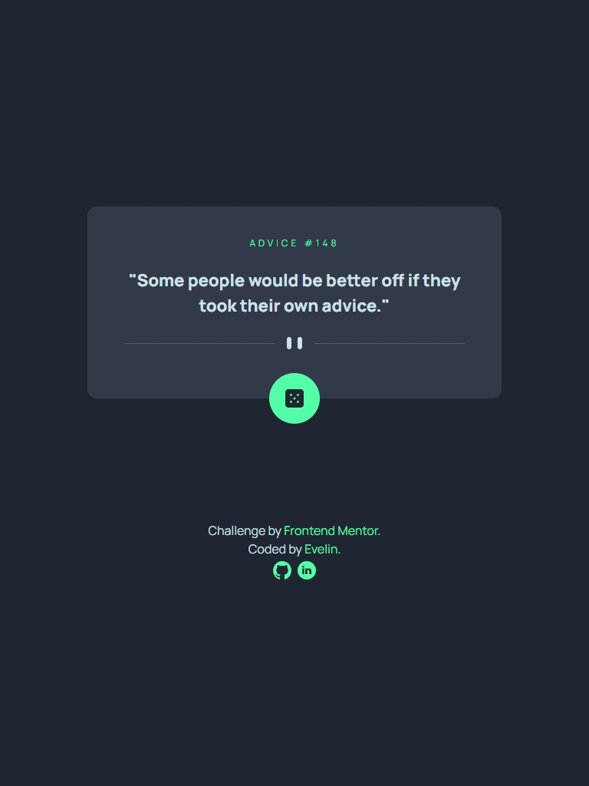

 
  <h1>Advice Generator App</h1>

 
  
   
  
  
  
  
  

## Description

This is an Advice Generator app built with React. It fetches random pieces of advice from the Advice Slip API and displays them to the user. The app includes a button to fetch a new piece of advice, and it supports both mobile and desktop views with responsive design.

## Key Features

- Fetch and display random pieces of advice.

- Responsive design optimized for both mobile and desktop devices.

- Smooth and user-friendly interface.

## Screenshots

  
    
   
     
   

## Additional Information

- Data for the advice geterator app was provided by a [Advice Slip JSON API](https://api.adviceslip.com/).
- Icons used in the project are sourced from [svgrepo.com](https://www.svgrepo.com/).
- Challenge by [Frontend Mentor](https://www.frontendmentor.io).

Check out the live project: [Advice Generator App](https://advice-generator-app-one-sooty.vercel.app/)
